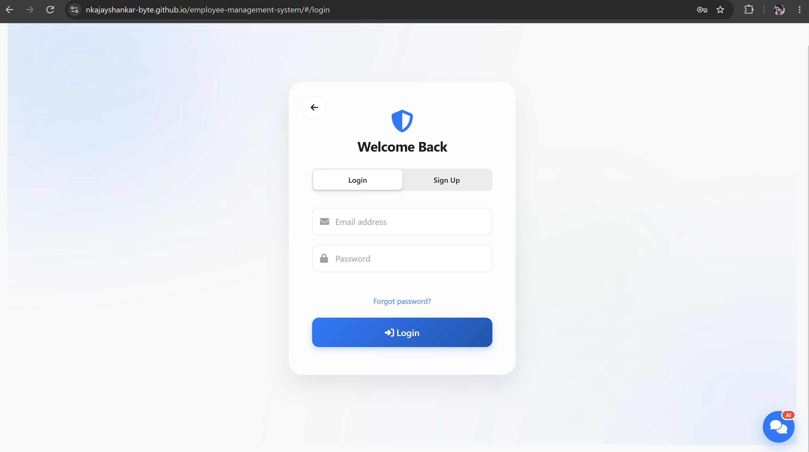
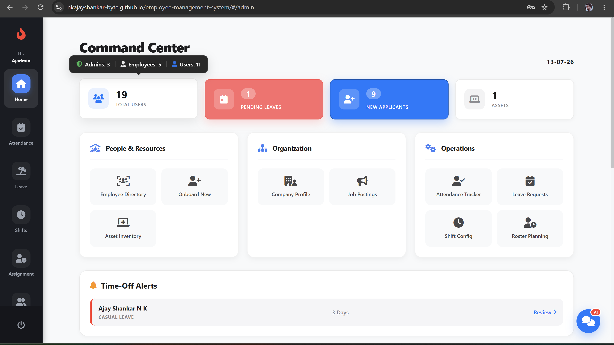
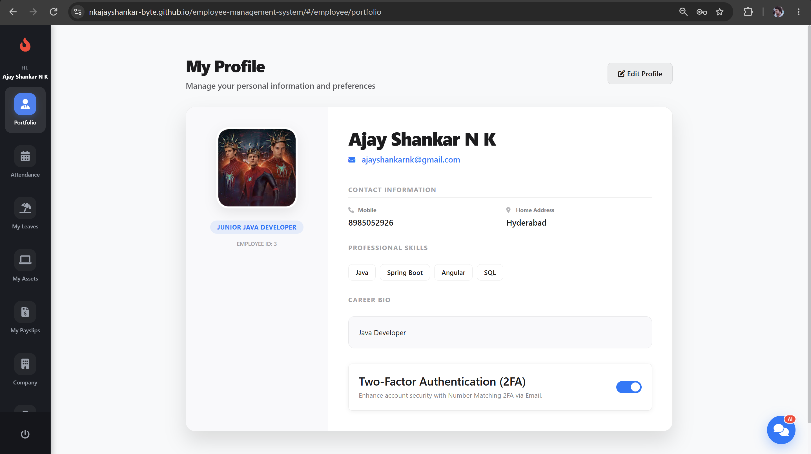
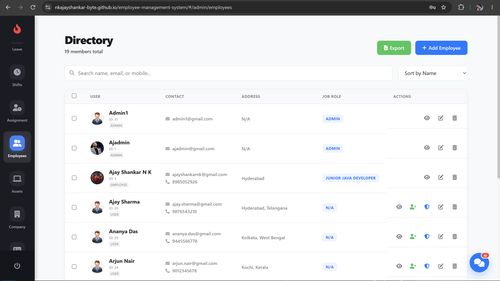
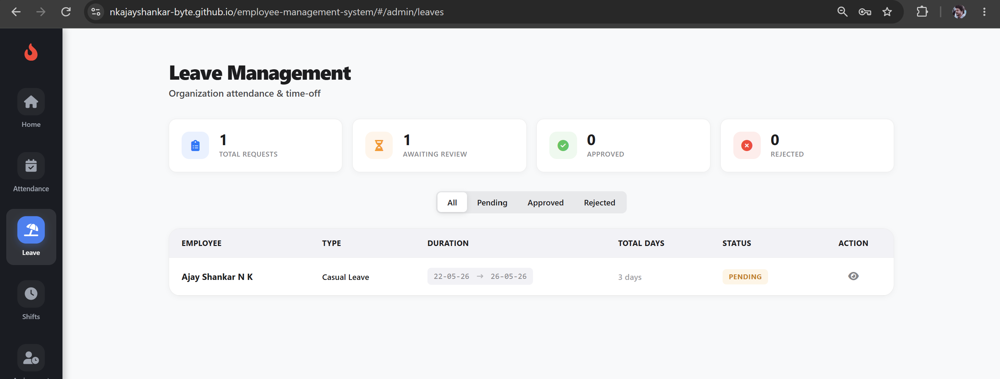
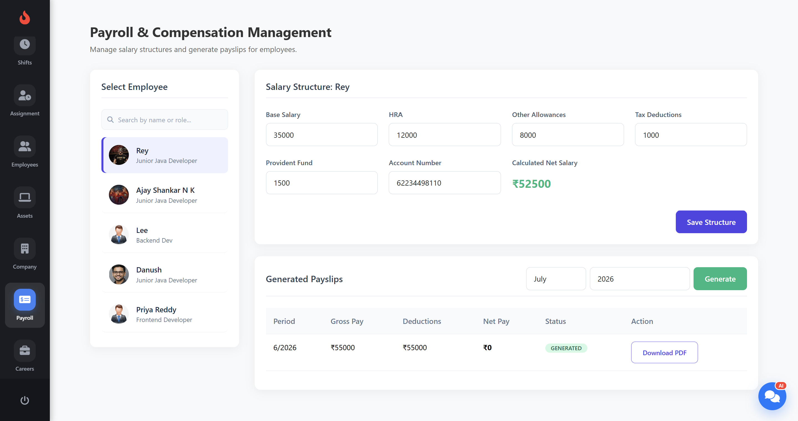
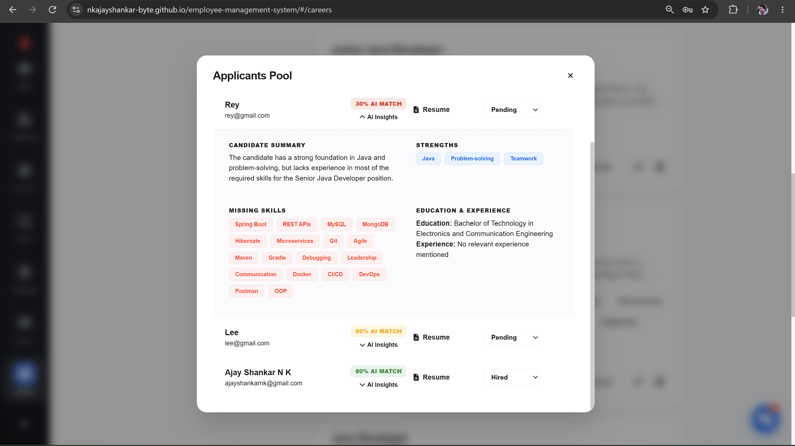
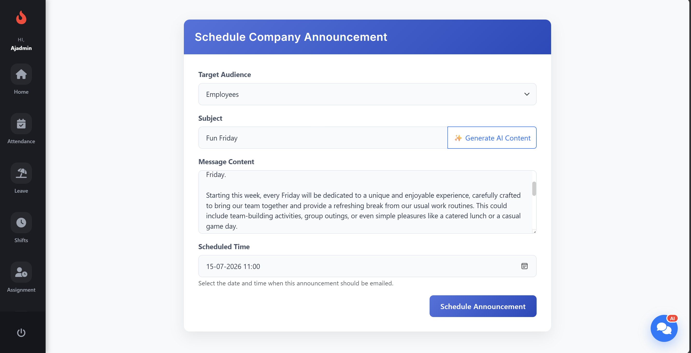

# Employee Management System

A full-stack **Employee Management System** built using **Spring Boot** (Backend) and **Angular** (Frontend). The application provides secure employee management with role-based authentication, asset management, leave management, AI-powered resume screening and chat bot, file uploads, email notifications, and more.

---

## 🚀 Features

- 🔐 JWT-based Authentication & Authorization with 2FA
- 👥 Role-Based Access Control (Admin & Employee)
- 👨‍💼 Employee Management (CRUD Operations)
- 📅 Leave Management
- 💻 Asset Management
- 🏢 Company Information Management
- 📄 AI-Powered Resume Screening and Chat Bot (Spring AI + Groq)
- 📧 AI-Powered Scheduled Email Announcements (Spring AI + Brevo)
- ☁️ Cloudinary Image Upload
- 📊 Excel & PDF Export
- 🐳 Docker & Docker Compose Support
- 📱 Responsive Angular UI

---

## 🛠️ Technologies Used

### Backend

- Java 17
- Spring Boot 3.2.4
- Spring Security
- JWT Authentication
- Spring Data JDBC
- MySQL
- Spring AI (Groq/OpenAI Compatible)
- Cloudinary
- Apache POI
- Apache PDFBox
- JavaMailSender
- Maven

### Frontend

- Angular
- TypeScript
- HTML5
- CSS3
- Bootstrap
- Nginx (Production)

### DevOps

- Docker
- Docker Compose

---

## 📂 Project Structure

```text
EmployeeManagement/
│
├── docker-compose.yml
├── README.md
│
├── backend/
│   ├── src/                 # Spring Boot Backend
│   ├── pom.xml
│   └── Dockerfile
│
├── frontend/
│   ├── src/                 # Angular Application
│   ├── nginx.conf
│   └── Dockerfile
│
└── screenshots/             # Demo screenshots
```

---

# 🐳 Running with Docker (Recommended)

The easiest way to run the complete application is with Docker.

## Prerequisites

- Docker Desktop installed
- Docker Compose (included with Docker Desktop)
- Docker Desktop running

## Setup

1. Clone the repository.

2. Navigate to the project directory.

3. Configure the required environment variables if you want to use optional integrations:

- Brevo API
- Cloudinary
- Groq/OpenAI API

Create free accounts on each platform and generate the required API keys from their dashboards.

These can be configured in:

- `application.properties`
- Docker Compose environment variables

4. Build and start all services:

```bash
docker compose up --build
```

This starts:

- MySQL Database
- Spring Boot Backend
- Angular Frontend

## Access the Application

| Service | URL |
|---------|-----|
| Angular Frontend | http://localhost:4200 |
| Spring Boot Backend | http://localhost:8080 |
| MySQL | localhost:3307 |

## Stop the Application

```bash
docker compose down
```

To remove all containers, networks and database volumes:

```bash
docker compose down -v
```

---

# 💻 Manual Setup

## Prerequisites

- Java 17+
- Node.js & npm
- Maven
- MySQL Server

---

## Backend Setup

Navigate to the backend directory:

```bash
cd backend
```

Configure the following in `src/main/resources/application.properties`:

- MySQL Database
- JWT Secret
- Brevo API Key
- Cloudinary Credentials
- Groq/OpenAI API Key

Run the backend:

```bash
mvn clean install
mvn spring-boot:run
```

---

## Frontend Setup

Navigate to the frontend directory:

```bash
cd frontend
```

Install dependencies:

```bash
npm install
```

Run Angular:

```bash
ng serve
```

Open:

```
http://localhost:4200
```

---

## 🔑 Environment Variables

The following environment variables can be configured:

| Variable | Description |
|----------|-------------|
| SPRING_DATASOURCE_URL | MySQL Connection URL |
| SPRING_DATASOURCE_USERNAME | Database Username |
| SPRING_DATASOURCE_PASSWORD | Database Password |
| BREVO_API_KEY | Brevo Email API Key |
| CLOUDINARY_CLOUD_NAME | Cloudinary Cloud Name |
| CLOUDINARY_API_KEY | Cloudinary API Key |
| CLOUDINARY_API_SECRET | Cloudinary API Secret |
| GROQ_API_KEY | Groq/OpenAI API Key |

---

## 📸 Screenshots

### Login Page


### Admin Dashboard


### Employee Dashboard


### Employee Management


### Leave Management


### Payroll Management


### AI Resume Screening


### Email Scheduling


---


## 👨‍💻 Author

**Ajay Shankar N K**

GitHub: https://github.com/nkajayshankar-byte

---


